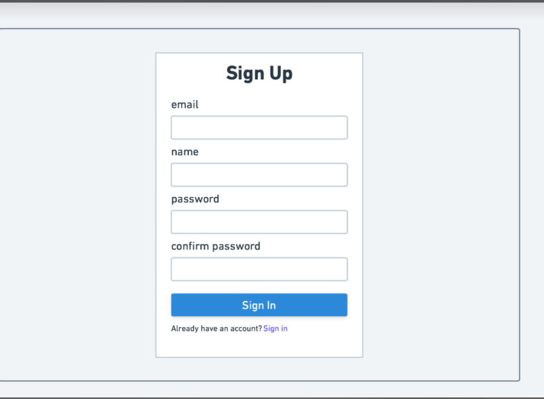
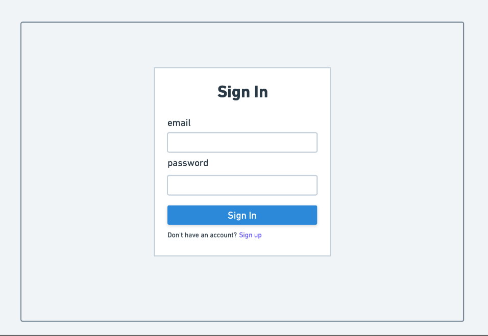
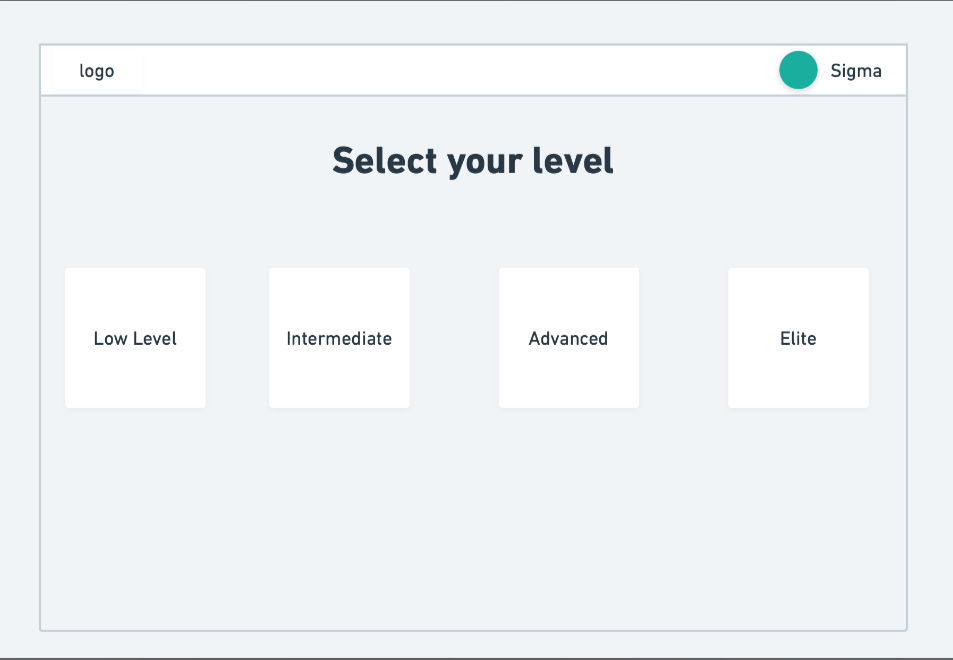
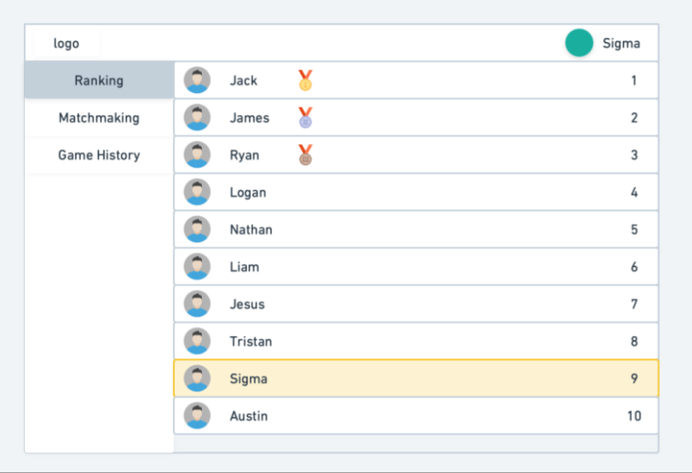
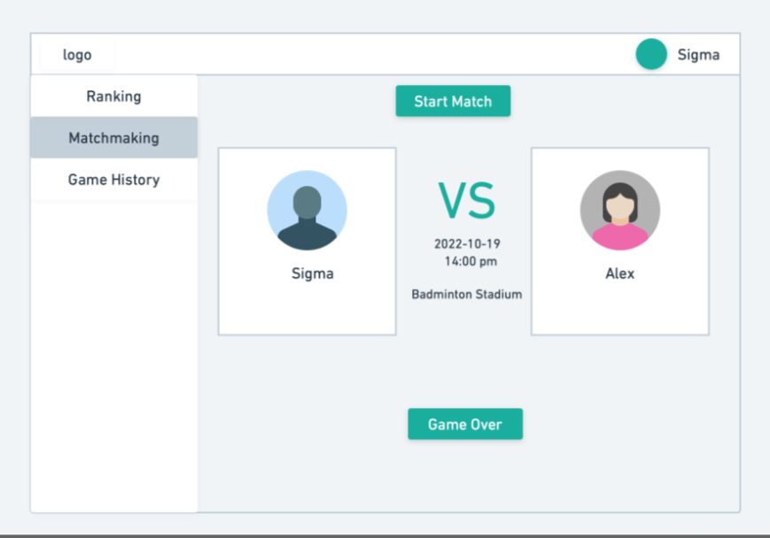
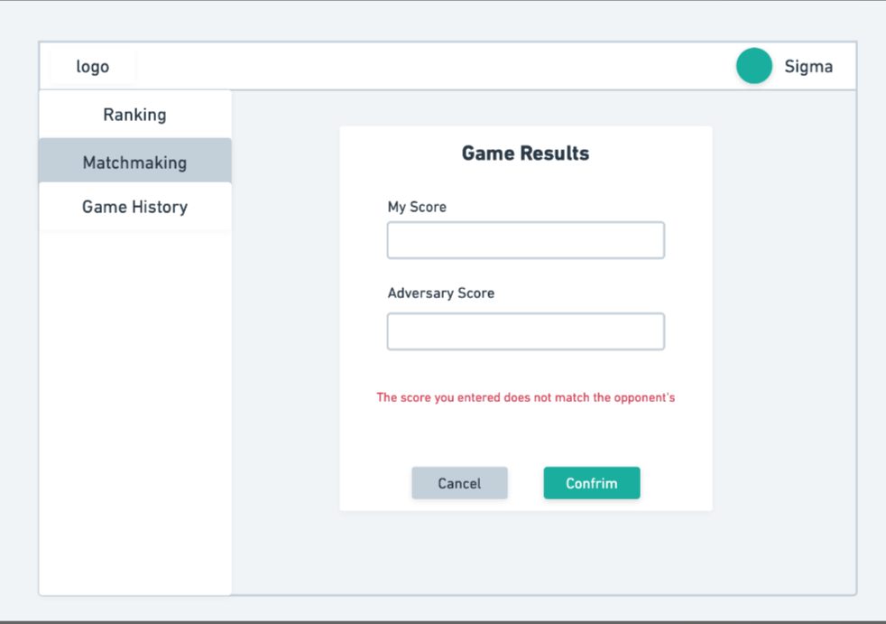
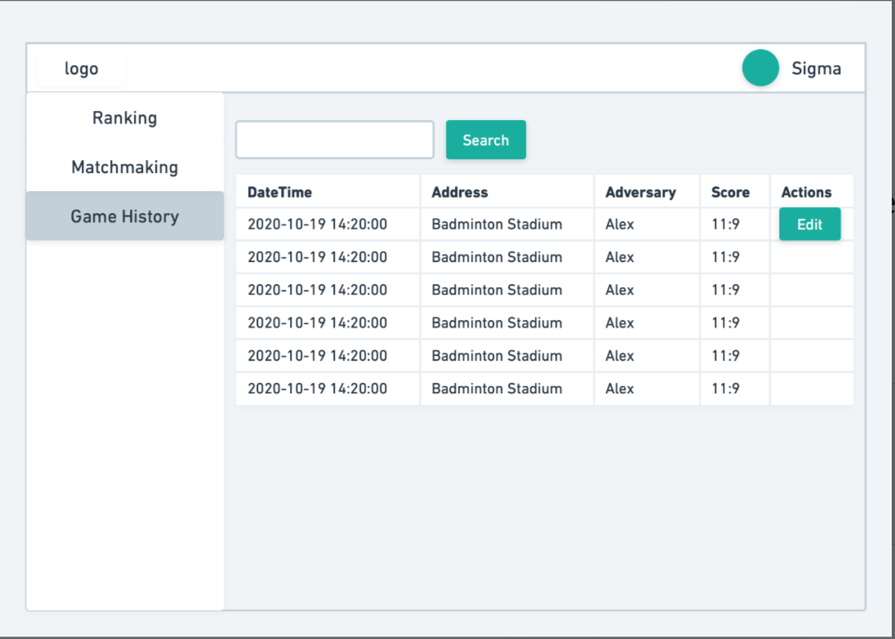

# Data Interactions:

Wireframes made using whimsical.com

## - Step 1: ## 
User signs up by submitting a email, name, password, and a confirmation of the password.

## - Step 2: 
Once the user is signed up and added to our database, they are then redirected to the authentication/ sign in page. The user is prompted to enter their email and password they used previously when signing up.

## - Step 3:
The user selects what skill level they believe they possess. They are given a seleciton from either "Low Level", "Intermediate", "Advanced", and "Elite".

## - Step 4:
The user is greeted with the [app name]'s user interface where the user can select between 3 tabs; {Ranking, Matchmaking, Game History}. 
	- Ranking: Displays your rank. Lists you with others within a comparable range. Special stickers given to top 3 players.

	 

	- Matchmaking: Gives you the option to search for a match with others that are also searching within the same ranking range. If a match is found then the user interface displays your found game instance. Gives you the option to start and to select game over when the game concludes,

	 
	
	after which each user writes down the score.

	

	- Game History: Displays your recent games and how much points it added/subtracted from your ELO. This determines who you match up against in the future. 

	